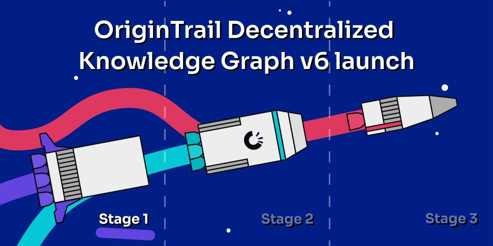

# README 

##  Ansible Playbook "OriginTrail Decentralize Knowledge Graph V6 Node"

The Ansible Playbook automates the installation of an OriginTrail Decentralized 
Knowledge Node V6 during the testing phases. It may serve as a base for the setup of 
production node later in 2020. 

The installation is aiming for the Linux Ubuntu `x86_64` System Architeture and was tested with 
the Ubuntu version `20.04`.

* Refer to the [OriginTrail Launch Roadmap](https://medium.com/origintrail/launching-the-origintrail-v6-stages-explained-3997797d44c0)

The automation is based on the dockerless installation manual

* Refer to the [manual Installation instructions](https://docs.origintrail.io/dkg-v6-upcoming-version/setup-instructions-dockerless)

### Current Status and Issues

Refer to the [Github Issues](https://github.com/talfco/clb-origin-trail-v6-node-ansible/issues/) about the current 
status and oustanding tasks. Feel free to log enhancements requests or new bugs.

### User Manual

All details can be found in the following Medium article [link to be provided]()

### Release Notes

